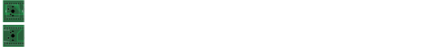

Keyboard PCB for Raspberry Pi Pico (25x1)
=========================================

Overview
--------

PCB for a 25x1 keyboard connected to a Raspberry Pi Pico.

Dimensions: 25.4mm W × 499.11mm H × ~18mm D

Usage
-----

This is a KiCad project. Manufacture the PCB and then insert a Raspberry Pi
Pico at the top with the USB connector facing upwards. Fit Cherry MX switches
in all positions and connect external RGB LEDs (optional).

Components
----------

+-----------+----------------------------------------------------------------+
| Ref       | Name                                                           |
+===========+================================================================+
|           | Raspberry Pi Pico                                              |
+-----------+----------------------------------------------------------------+
| PICO-L1   | 1x20 Pin Socket, Through Hole (2.54mm)                         |
+-----------+----------------------------------------------------------------+
| PICO-R1   | 1x20 Pin Socket, Through Hole (2.54mm)                         |
+-----------+----------------------------------------------------------------+
| LEDS1     | 1x04 Pin Header, Right-Angled Through Hole (2.54mm) (optional) |
+-----------+----------------------------------------------------------------+
| SW1..SW25 | Cherry MX keyswitch (1.00u)                                    |
+-----------+----------------------------------------------------------------+

Switches
--------

1. GP0
2. GP1
3. GP2
4. GP11
5. GP10

6. GP9
7. GP8
8. GP7
9. GP6
10. GP5

11. GP4
12. GP3
13. GP15
14. GP14
15. GP13

16. GP12
17. GP19
18. GP18
19. GP17
20. GP16

21. GP20
22. GP21
23. GP22
24. GP26
25. GP27

LEDs
----

The LEDS1 pin header has GP28 for data, 3.3V, 5V and GND.

Related Software
----------------

* `QMK (Quantum Mechanical Keyboard) Firmware <https://github.com/nomis/qmk_firmware/tree/rpi_pico_25x1/keyboards/nomis/rpi_pico_25x1>`_
